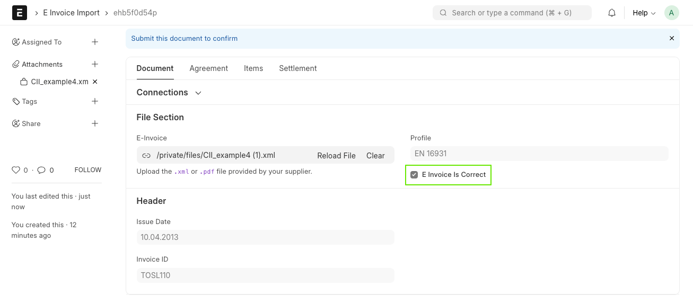
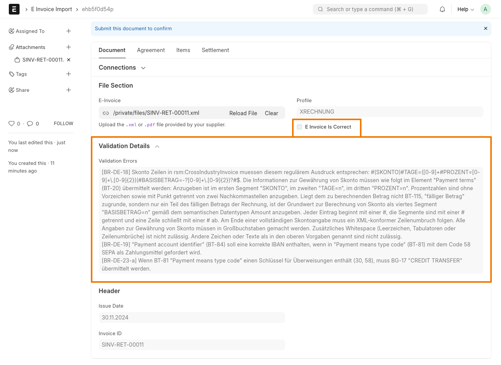

## European e-Invoice

Create and import e-invoices with ERPNext.

In particular, this app supports reading and writing electronic invoices according to the UN/CEFACT Cross-Industry-Invoice (CII) standard in the following profiles:

- BASIC
- EN 16931
- EXTENDED
- XRECHNUNG

All profiles except for "XRECHNUNG" can be embedded in a PDF file, known as ZUGFeRD or Factur-X.

<a href="https://www.zugferd-community.net/de/alyf_gmbh" target="_blank">
    
</a >

---

This app cannot currently read or write UBL invoices. It also does not provide any special way of sending or receiving e-invoices (e.g. Peppol). Instead, it focuses on the conversion between ERPNext's internal data model and the XML format of the above standards.

## Installation

You can install this app using the [bench](https://github.com/frappe/bench) CLI:

```bash
cd $PATH_TO_YOUR_BENCH
bench get-app https://github.com/alyf-de/eu_einvoice --branch $MAJOR_VERSION
bench install-app eu_einvoice
```

Please use a branch (`MAJOR_VERSION`) that matches the major version of ERPNext you are using. For example, `version-14` or `version-15`. If you are a developer contributing new features, you'll want to use the `develop` branch instead.

## Setup

### Code Lists

E-invoices rely on common codes that describe the content of the invoice. E.g. "C62" is used for the UOM "One" and "ZZZ" is used for a mutually agreed mode of payment.

Common codes are part of a code list. You'll need to import the code lists and map the codes you need to the corresponding ERPNext entities. Please use the "Import Genericode" button in **Code List** and paste the URL linked below.

Code List | Mapped DocType | Default Value
----------|----------------|--------------
[UNTDID 4461 Payment means code](https://www.xrepository.de/api/xrepository/urn:xoev-de:xrechnung:codeliste:untdid.4461_3:technischerBestandteilGenericode) | Payment Terms Template, Mode of Payment | ZZZ
[Codes for Units of Measure Used in International Trade](https://www.xrepository.de/api/xrepository/urn:xoev-de:kosit:codeliste:rec20_3:technischerBestandteilGenericode) | UOM | C62
[Codes for Passengers, Types of Cargo, Packages and Packaging Materials](https://www.xrepository.de/api/xrepository/urn:xoev-de:kosit:codeliste:rec21_3:technischerBestandteilGenericode) (optional) | UOM | C62
[Codes for Duty Tax and Fee Categories](https://www.xrepository.de/api/xrepository/urn:xoev-de:kosit:codeliste:untdid.5305_3:technischerBestandteilGenericode) | Item Tax Template, Account, Tax Category, Sales Taxes and Charges Template | S
[VAT exemption reason code list](https://www.xrepository.de/api/xrepository/urn:xoev-de:kosit:codeliste:vatex_1:technischerBestandteilGenericode) | Item Tax Template, Account, Tax Category, Sales Taxes and Charges Template | vatex-eu-ae
[Electronic Address Scheme](https://www.xrepository.de/api/xrepository/urn:xoev-de:kosit:codeliste:eas_5:technischerBestandteilGenericode) (Mapping: _as Title_: scheme-name, _as Code_: aesc, _as Description_: remark) | N/A | EM

For example, let's say your standard **Payment Terms Template** is "Bank Transfer, 30 days". You'll need to find the suitable **Common Code** for bank transfers within the **Code List** "UNTDID.4461". In this case, the code is "58". Then you add a row to the _Applies To_ table, select "Payment Terms Template" as the _Link Document Type_ and "Bank Transfer, 30 days" as the _Link Name_. If you now create an Invoice with this **Payment Terms Template**, the eInvoice will contain the code "58" for the payment means, signalling that the payment should done via bank transfer.

The retrieval of codes goes from the most specific to the most general. E.g. for determining the VAT type of a line item, we first look for a code using the specific item's _Item Tax Template_ and _Income Account_, then fall back to the code for the invoice's _Tax Category_ or _Sales Taxes and Charges Template_.

### Buyer Reference

If you work with government customers or similar large organizations, you might need to specify their _Buyer Reference_ in the eInvoice. This is done by setting the _Buyer Reference_ field in the **Sales Invoice**. You can already fill this field in the **Customer** master data or the **Sales Order**.

The national terms for this field are:

- Germany: _Leitweg-ID_
- France: _Code Service_

### Electronic Address

If you send your invoice via PEPPOL, you might need to specify your and your customer's electronic addresses. This is done by setting the _Electronic Address Scheme_ and _Electronic Address_ fields in the **Company**, **Customer** and **Supplier** master data.

Please make sure to import the **Electronic Address Scheme** code list first.

If not specified, email addresses are used as electronic addresses for outgoing invoices. For the Customer, we use the _Contact Email_ or _Buyer Address_ > _Email ID_. For the Company, we use the _Seller Contact_ > _Email ID_ or _Company_ > _Email_.

### Bank Details

If you want your eInvoice to contain bank details, you need to set up a **Mode of Payment** of type "Bank", link the company's corresponding **Account** and create a **Bank Account** for the same account. Moreover, you need to select this **Mode of Payment** in your **Payment Terms Template** under _Payment Terms_ -> _Mode of Payment_.

Then, you can map a **Common Code** from **Code List** "UNTDID.4461", e.g. "Credit Transfer" (30) or "SEPA Credit Transfer" (58), to the **Mode of Payment**.

Please note that the eInvoice standard only supports one payment means per invoice, so you should not specify multiple **Modes of Payment** in the same invoice.

### E Invoice Settings

eInvoice validation can be time-consuming. Use **E Invoice Settings** to configure when validation occurs and how errors are handled:

- **Validate Sales Invoice on Save/Submit**: Enable or disable validation at these stages.
- **Action on Validation Error**: Choose how to handle validation errors:
  - *Empty* (default): No action taken
  - *Warning Message*: Show errors but allow save/submit
  - *Error Message*: Block save/submit and show errors

## Usage

### Sales Invoice

To create an outgoing eInvoice, you need to create a **Sales Invoice** and select the _E Invoice Profile_ you want to use.

The following fields of the **Sales Invoice** are currently considered for the eInvoice:

<details>
<summary>List of exported fields</summary>

- Invoice type (credit note, corrected invoice, commercial invoice)
- Invoice number
- Invoice date
- Due date
- From date
- To date
- Language
- Currency
- Company
    - Phone No
    - Email
    - Fax
    - Electronic Address Scheme
    - Electronic Address
- Company Name
- Company Address
    - Address Line 1
    - Address Line 2
    - Postcode
    - City
    - Country
- Company Contact Person
    - Full Name
    - Email Address (takes precedence over Company > Email)
    - Phone (takes precedence over Company > Phone No)
    - Department
- Company Tax ID
- Customer
    - Electronic Address Scheme
    - Electronic Address
- Customer Name
- Buyer Reference (fetched from **Sales Order** or **Customer**)
- Customer Address
    - Address Line 1
    - Address Line 2
    - Postcode
    - City
    - Country
    - Email ID (only if Contact Email is not set)
- Contact Email
- Contact Person
    - Full Name
    - Phone (takes precedence over Mobile No)
    - Email Address
    - Mobile No
    - Department
- Shipping Address
    - Address Title (falls back to _Customer Name_)
    - Address Line 1
    - Address Line 2
    - Postcode
    - City
    - Country
- Customer's Purchase Order
- Customer's Purchase Order Date
- Customer's Tax ID
- Items:
    - Item Name
    - Description
    - Company's Item Code
    - Customer's Item Code
    - Delivery Note number and date
    - Sales Order number and date (added on document level, only if there is exactly one Sales Order)
    - Quantity + Unit
    - Rate
    - Net Amount
    - Amount
- Terms and Conditions Details (converted to markdown)
- Incoterm and named place
- Payment Schedule
    - Mode of Payment -> Account -> Bank Account
        - IBAN
        - Bank
            - SWIFT Number
    - Description
    - Due date
    - Amount
    - Discount Type (must be "Percentage")
    - Discount
    - Discount Date
- Sales Taxs and Charges
    - The _Charge Type_ "Actual" is used as logistics or service charges. It is only supported by the eInvoice profiles "EXTENDED" and "XRECHNUNG". If you want to add VAT for the service charge, you need to add a _Charge Type_ "On Previous Row Amount" or "On Previous Row Total" immediately after the service charge.
    - For _Charge Type_ "On Net Total", the taxable amount is calculated as `tax_amount / rate * 100`, if the rate is available in the tax row or in the corresponding Account [1].
    - The _Charge Type_ "On Item Quantity" is not supported.
- Total
- Net Total
- Total Taxes and Charges
- Grand Total
- Total Advance
- Outstanding Amount
- Embedded Document
    This attachment field can be used to embed an additional supporting document into the e-invoice (XML-)file. For example, a time report in PDF format.

[1] The correct taxable amount is only available starting from ERPNext v16. For earlier versions we currently have to approximate it, which comes with a small error margin.

</details>

The actual delivery date is set to the latest posting date of the linked **Delivery Notes**, if available. Otherwise, it is set to the invoice's _To Date_ or _Posting Date_ (in that order of priority).

ERPNext won’t accept negative quantities, and the e-invoice rules (BR-27) won’t accept negative prices. To work around this, we flip the signs: a line that would have had a negative price and positive quantity is instead sent with a positive price and a negative quantity.

Document-level discounts are currently not supported, because the e invoice standard requires much more information than just the discount amount (e.g. the reason and applicable VAT rate).

During validation of the **Sales Invoice**, the potential eInvoice is created and validated against the schematron rules for the selected _E Invoice Profile_, so that you can see any potential problems before submitting it.

#### Export Sales Invoice as XML (XRechnung) or PDF+XML (ZUGFeRD)

To download the XML file (XRechnung), open a **Sales Invoice** and click on "..." > "Download eInvoice".

When you open the print preview of the **Sales Invoice** and click on "PDF", the generated PDF file will have the e-invoice XML embedded. An exception is the _E Invoice Profile_ "XRECHNUNG", which is intended to be a plain XML file. In this case, the PDF will not have the XML embedded.

> [!TIP]
> You can test both XML and PDF+XML files by re-importing them, using the **E Invoice Import** DocType.

#### PDF/A-3 conversion

The app will automatically attempt to convert the PDF to PDF/A-3 format before embedding the XML. This ensures maximum compatibility with document management systems and long-term archival requirements.

This conversion is done using [Ghostscript](https://www.ghostscript.com/), a free, open-source interpreter for the PostScript language and for PDF files.

The conversion requires:

1. Ghostscript to be installed globally on your system/server
2. The ICC profile `srgb.icc` to be available in Ghostscript's search paths

If Ghostscript is installed and the conversion fails, the app will fall back to embedding the XML in a regular PDF file and log an error message.

#### Embedding the Factur-X logo

If you like, you can embed one of the official Factur-X logos in your invoice PDF. This way, a human can easily identify the invoice as a Factur-X eInvoice.

To do this, use the `get_einvoice_logo` method in your jinja **Print Format**. This method returns a base64-encoded data URL, which can be used in an `` tag.

```jinja

```

The following logos are available:

BASIC | EN 16931 | EXTENDED
--- | --- | ---
 |  | 

### Purchase Invoice

To import a new eInvoice, create a new **E Invoice Import** and upload the XML or PDF file.

We extract the E-Invoice Profile and validate the XML against the corresponding schematron rules.

A correct eInvoice will look like this:



A problematic eInvoice will look like this. You can see the validation errors in the _Validation Details_ section:



It is still possible to import an invoice, even if there are formal validation errors.

<details>
<summary>List of imported fields</summary>

The following fields are currently imported from the eInvoice:

- Invoice ID
- Issue Date
- Currency
- Seller (Supplier)
    - Name
    - Tax ID
    - Electronic Address Scheme
    - Electronic Address
    - Address
        - Address Line 1
        - Address Line 2
        - Postcode
        - City
        - Country
- Buyer (Company)
    - Name
    - Electronic Address Scheme
    - Electronic Address
    - Address
        - Address Line 1
        - Address Line 2
        - Postcode
        - City
        - Country
- Buyer Reference (mapped to Purchase Order if it exists)
- Items
    - Product Name
    - Product Description
    - Seller's Product ID
    - Buyer's Product ID (mapped to Item Code if it exists)
    - Billed Quantity
    - Unit Code (mapped to UOM)
    - Net Rate
    - Tax Rate
    - Total Amount
- Taxes
    - Basis Amount
    - Rate Applicable Percent
    - Calculated Amount
- Payment Terms
    - Due Date
    - Partial Amount
    - Description
    - Discount Basis Date
    - Discount Calculation Percent
    - Discount Actual Amount
- Payment Means
    - Payee Account Name
    - Payee BIC
    - Payee IBAN
- Billing Period
    - Start Date
    - End Date

</details>

Taxes are mapped to "Actual" charges in the **Purchase Invoice**, so that ERPNext does not try to recalculate them.

You can find XML files for testing in the following repositories:

- [EN16931](https://github.com/ConnectingEurope/eInvoicing-EN16931/tree/master/cii/examples)
- [XRechnung](https://projekte.kosit.org/xrechnung/xrechnung-testsuite/-/tree/master/src/test/business-cases/standard?ref_type=heads) (files ending in `_uncefact.xml`)

## Add your custom logic

This app provides hooks to add custom logic to the eInvoice creation process:

- `before_einvoice_generation`

    Called right before the eInvoice is generated. The hook function receives the **Sales Invoice** as an argument and can modify it.

- `after_einvoice_generation`

    Called right after the eInvoice is generated. The hook function receives the **Sales Invoice** and the generated eInvoice as arguments.

For example, your `myapp/hooks.py` could look like this:

```python
doc_events = {
	"Sales Invoice": {
		"before_einvoice_generation": "myapp.einvoice.before_einvoice_generation",
		"after_einvoice_generation": "myapp.einvoice.after_einvoice_generation",
	}
}
```

And your `myapp/einvoice.py` like this:

```python
from typing import TYPE_CHECKING

if TYPE_CHECKING:
    from drafthorse.models.document import Document
    from erpnext.accounts.doctype.sales_invoice.sales_invoice import SalesInvoice


def before_einvoice_generation(doc: "SalesInvoice", event: str):
    """Modify the Sales Invoice object before generating the eInvoice."""
    doc.customer_name = "Special Customer Name"


def after_einvoice_generation(doc: "SalesInvoice", event: str, einvoice: "Document"):
    """Modify the generated eInvoice after it was created."""
    einvoice.trade.agreement.buyer.name = doc.customer_name
```

> [!WARNING]
> These methods are also triggered during the `validate` event of the **Sales Invoice**. In this case, if you change the Sales Invoice object, these changes will be saved to the database.

## External validation

You can upload an XML invoice file to https://www.itb.ec.europa.eu/invoice/upload and validate it as "CII Invoice CML". Please use the _E Invoice Profile_ "EN 16931" for generating your invoice.

E-invoices according to the "XRECHNUNG" profile can be validated at https://erechnungsvalidator.service-bw.de.

## Contributing

This app uses `pre-commit` for code formatting and linting. Please [install pre-commit](https://pre-commit.com/#installation) and enable it for this repository:

```bash
cd apps/eu_einvoice
pre-commit install
```

Pre-commit is configured to use the following tools for checking and formatting your code:

- ruff
- eslint
- prettier
- pyupgrade

### CI

This app can use GitHub Actions for CI. The following workflows are configured:

- CI: Installs this app and runs unit tests on every push to `develop` branch.
- Linters: Runs [Frappe Semgrep Rules](https://github.com/frappe/semgrep-rules) and [pip-audit](https://pypi.org/project/pip-audit/) on every pull request.

### Dependencies

- [drafthorse](https://pypi.org/project/drafthorse/) by Raphael Michel, released under the Apache License 2.0

    Used to create and parse XML invoices.

- [factur-x](https://pypi.org/project/factur-x/) by Alexis de Lattre, released unser a BSD License

    Used to extract XML data from PDF files, and to create PDF files with embedded XML.

- [SaxonC](https://pypi.org/project/saxonche/) by Saxonica

    Used for XSL transformation (validate XML against schematron).

- [lxml](https://github.com/lxml/lxml) by Infrae

    Used for general XML parsing.

- [SchXslt](https://github.com/schxslt/schxslt) by David Maus

    Used to convert Schematron files to XSL.

## Sponsors

Many thanks to the following companies for sponsoring the initial development of this app:

- aepfel+birnen IT GmbH
- axessio Hausverwaltung GmbH
- Burkhard Baumsteigtechnik GmbH & Co. KG
- DriveCon GmbH
- ibb testing gmbh
- itsdave GmbH
- iXGate UG
- Kautenburger IT GmbH
- MERECS Engineering GmbH
- Royal Software GmbH
- voidsy GmbH
- … and many more

> [!NOTE]
> We only list companies that have explicitly agreed to have their name published here. If you want to be listed here too, please send us a short note by email.

## License

Copyright (C) 2024 ALYF GmbH

This program is free software: you can redistribute it and/or modify it under the terms of the GNU General Public License as published by the Free Software Foundation, either version 3 of the License, or(at your option) any later version.

This program is distributed in the hope that it will be useful, but WITHOUT ANY WARRANTY; without even the implied warranty of MERCHANTABILITY or FITNESS FOR A PARTICULAR PURPOSE. See the GNU General Public License for more details.

You should have received a copy of the GNU General Public License along with this program. If not, see <https://www.gnu.org/licenses/>.
